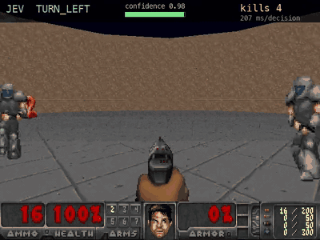
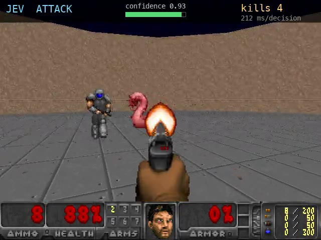
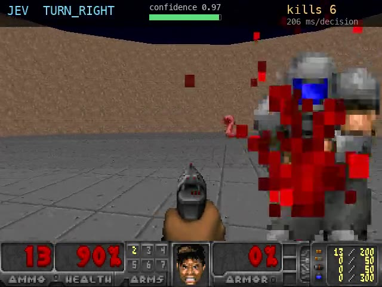

<div align="center">

# Jev Plays Doom

**Doom played by a model that never sees the screen.** Structured
game state goes in, one button comes out.

[](https://www.python.org/)
[](https://vizdoom.farama.org/)
[](LICENSE)



<sub>Full minute: [`docs/jev-doom.mp4`](docs/jev-doom.mp4). See
[Recording](#recording).</sub>

</div>

## What the model is

A language model returns text. Getting a decision out of it means parsing that
text and handling the cases where the wording changes.

This one returns the decision. The request carries the state and a question
with a fixed set of allowed answers. The response is one of those answers, plus
a probability for each one and a confidence value derived from how concentrated
those probabilities are. No parsing step exists because no free text is
produced.

The model is [Jev](https://docs.typesafe.ai/), from TypeSafe AI, trained with
Reinforcement Learning for Calibrated Decisions (RLCD). The calibration is the
part that matters here: the probabilities are meant to reflect real uncertainty
rather than decorate the answer, which is testable and is tested below.
TypeSafe calls this category of model System One.

Responses take milliseconds rather than seconds, which is what makes a game
loop practical.

## How it works

```
  ViZDoom (headless)                doom_agent.py              Jev
 ┌──────────────────┐   objects,   ┌──────────────┐   JSON    ┌────────────┐
 │ defend_the_      ├─ positions ─►│ describe()   ├── state ─►│ Choice over│
 │ center.wad       │   health,    │  → bearings  │           │ 3 buttons  │
 │                  │◄── ammo ─────┤              │◄─"ATTACK"─┤            │
 └──────────────────┘ make_action  └──────────────┘           └────────────┘
```

The model receives monster bearings and distances as JSON. It does not receive
frames.

## Quick start

```bash
uv sync --extra jev
.venv/bin/python selfcheck.py
.venv/bin/python doom_agent.py --brain heuristic
```

`selfcheck.py` verifies the install and runs the scripted brain. No API key is
required for either command.

To run the model, create a key at
[console.typesafe.ai](https://console.typesafe.ai/) and add it to `.env`:

```bash
cp .env.example .env        # set TYPESAFE_API_KEY
.venv/bin/python doom_agent.py --brain jev --episodes 20 --quiet
```

`.env` is gitignored and loaded on import. An exported environment variable
takes precedence.

## Scores

`defend_the_center` places the player at the centre of a circular arena with a
pistol, 26 bullets, and no ability to move. Score is kills before death.

20 episodes, seed 1234, identical for every brain.

| brain | kills | spread | latency | confidence |
|---|---|---|---|---|
| random | 0.75 | -1 to 3 | n/a | n/a |
| hand-coded aim | 6.55 | 4 to 9 | 0 ms | n/a |
| Jev (RLCD) | 6.55 | 5 to 11 | 212 ms | 0.88 mean |

Both totalled 131 kills. Per-episode scores differ, so the matching mean is
coincidence rather than an identical policy. Latency stayed at 212 ms across
2,642 calls.

### Effect of the criteria

`--criteria rule` states the firing threshold in the option descriptions.
`--criteria intent` describes what each button achieves and leaves the
threshold to the model. Same seed, same state, same three options.

| criteria | kills | ATTACK picks per 30 decisions | confidence |
|---|---|---|---|
| `rule` | 6.20 | 10 | 0.88 |
| `intent` | -0.60 | 0 | 0.65 |

Under `intent` the model selects a turn on every decision and the episode ends
with the magazine full. Three further phrasings produce the same outcome:

| phrasing | ATTACK picks per 30 |
|---|---|
| turn options reworded to exclude the aligned case | 0 |
| weapon cone added to state as a fact | 0 |
| cost of turning stated alongside the cost of firing | 1 |

Given a numeric boundary, the RLCD model applies it consistently. Without one,
it does not select `ATTACK` from a bare `bearing_deg` value.

Confidence falls from 0.88 to 0.41 across these runs, reaching 0.07 on
individual calls, which is the RLCD calibration behaving as intended.
`--conf-floor 0.5` routes decisions below that threshold to the scripted brain.

> [!NOTE]
> Results cover one scenario and four phrasings. Both variants ship as a flag,
> so alternatives are cheap to test.

> [!NOTE]
> Episode scores are stochastic. The same brain varies by 4 to 5 kills between
> episodes, which is wider than most differences being measured. Unseeded
> five-episode runs of the scripted brain returned 8.80 and 6.80. Keep `--seed`
> fixed and the episode count high.

## Frames

| | |
|---|---|
|  |  |
| `ATTACK` at 0.93 confidence | `TURN_RIGHT` at 0.97 confidence |

`record.py` draws the chosen button, its confidence, the kill count, and mean
latency onto every frame.

## State

```json
{
  "health": 100,
  "ammo": 26,
  "facing_deg": 0,
  "monsters_nearest_first": [
    {"kind": "Demon", "distance": 244, "bearing_deg": -163},
    {"kind": "Demon", "distance": 283, "bearing_deg":   90}
  ],
  "note": "bearing 0 = dead ahead. POSITIVE means LEFT, NEGATIVE means RIGHT."
}
```

Bearings are computed in `describe()` from object positions and player angle.
Decoration objects are filtered out. Monsters are sorted by distance.

## Questions

```python
questions = {
    "action":    Choice(criteria=CRITERIA_RULE),
    "in_danger": Noul(instructions="Is a monster close enough to hurt you "
                                   "within the next second?"),
}
```

Both questions travel in one request. Independent questions are evaluated in
parallel, so the second adds little to response time. Sending them separately
would double latency per decision.

A `Choice` answer carries `choice`, `probabilities`, and `confidence`.

## Recording

Each decision is one API call. A 15 minute session is roughly 2,000 requests.
`record.py` captures a run once to an mp4:

```bash
uv sync --extra jev --extra record
.venv/bin/python record.py --out docs/jev-doom.mp4 --seconds 60
```

Frames are captured every tic (35 per second) rather than once per decision, so
playback runs at game speed. `imageio-ffmpeg` bundles its own ffmpeg binary.

The GIF and stills come from the same mp4:

```bash
FF=$(python -c "import imageio_ffmpeg;print(imageio_ffmpeg.get_ffmpeg_exe())")
$FF -ss 23.4 -t 4 -i docs/jev-doom.mp4 \
    -vf "fps=10,scale=400:-1,palettegen=max_colors=64" pal.png
$FF -ss 23.4 -t 4 -i docs/jev-doom.mp4 -i pal.png \
    -lavfi "fps=10,scale=400:-1[x];[x][1:v]paletteuse" docs/turn-then-shoot.gif
```

## Play it yourself

```bash
.venv/bin/python play.py
```

Opens a window on the same scenario and seed. Mouse or arrow keys turn, Ctrl
fires. Movement is unavailable, matching the three buttons the model receives.

## Custom brains

A brain is any callable taking the state dict and returning a button name:

```python
def my_brain(desc: dict) -> str:
    m = desc["monsters_nearest_first"]
    if not m:
        return "TURN_RIGHT"
    return "ATTACK" if abs(m[0]["bearing_deg"]) <= 8 else "TURN_LEFT"
```

Valid return values are `ATTACK`, `TURN_LEFT`, and `TURN_RIGHT`.

## Options

| flag | default | |
|---|---|---|
| `--brain` | `heuristic` | `heuristic`, `random`, or `jev` |
| `--criteria` | `rule` | `rule` or `intent`, applies to `--brain jev` |
| `--episodes` | `3` | |
| `--tics` | `4` | game tics per decision |
| `--seed` | `1234` | `-1` randomises |
| `--jev-model` | `jev-latest` | |
| `--conf-floor` | `0.0` | below this confidence, fall back to `heuristic` |
| `--quiet` | off | suppress per-episode lines |

## Layout

```
doom_agent.py    describe(), brains, episode loop
record.py        mp4 capture with overlay
play.py          human spectator mode
selfcheck.py     install and behaviour checks, no API key
docs/            recording, gif, stills
```

Game code lives in [ViZDoom](https://vizdoom.farama.org/), a research fork of
[ZDoom](https://zdoom.org/) shipping compiled engine binaries and Freedoom
assets.

## License

MIT. See [LICENSE](LICENSE).
